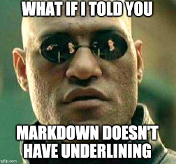

# Markdown syntax guide

## Headers

# This is a Heading h1
## This is a Heading h2 
###### This is a Heading h6

* * * 

## Emphasis

*This text will be italic*  
_This will also be italic_

**This text will be bold**  
__This will also be bold__

_You **can** combine them_

* * * 

## Lists

### Unordered

* Item 1
* Item 2
  * Item 2a
  * Item 2b
    * Item 2ba


### Ordered

1. Item 1
1. Item 2
1. Item 3
  1. Item 3a
  1. Item 3b

* * * 

## Images



* * * 

## Links

There are various online markdown editors where you can test
* [dillinger.io](https://dillinger.io/)
* [stackedit.io](https://stackedit.io/app#)
* [markdownlivepreview.com](https://markdownlivepreview.com/)

* * * 

## Blockquotes

> Its harder to read code than write it    
> --a programmer

* * * 

## Tables

| Left columns  | Right columns |
| ------------- |:-------------:|
| left foo      | right foo     |
| left bar      | right bar     |
| left baz      | right baz     |

* * * 

## Code Block

```
let message = 'Hello world';
alert(message);
```

New modern editors if they have packages installed they do highling based on code

```js
let message = 'Hello world';
alert(message);
```

## Inline code

This web site is using `markedjs/marked`.

* * * 

